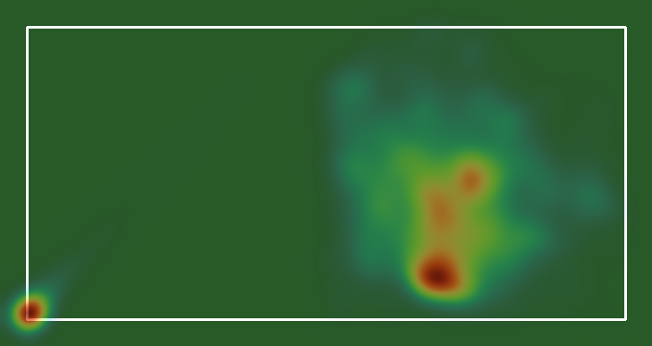
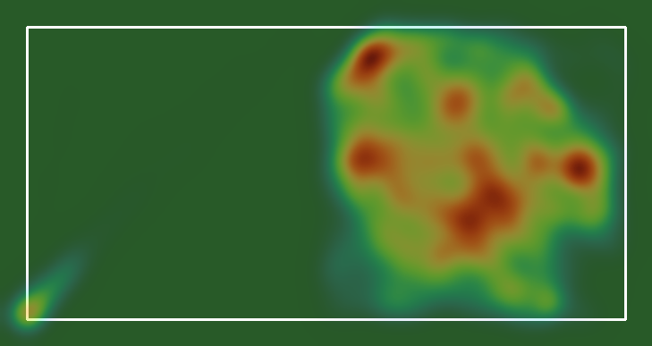
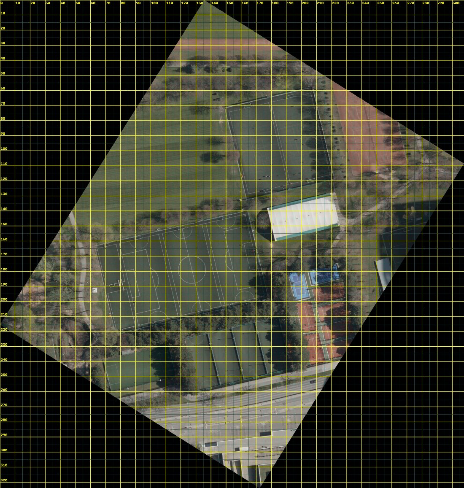
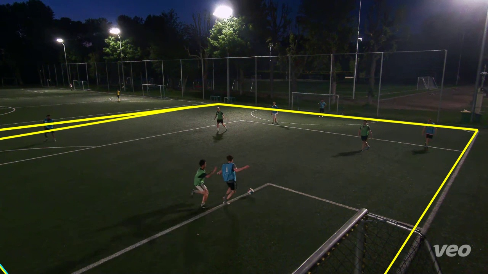

# FootballAnalytics

My amateur team records its games with a Veo camera. That comes to hours of
footage nobody ever turns into numbers. This project does it automatically: it
finds the players in the video, converts their image position into real meters on
the pitch, and turns that into heatmaps, running distances, and a split into the
two teams.

The core pipeline runs from the video file to metric player positions. I have run
and frame-checked it on a complete 14-minute recording. The difficult part was a
camera mounted exactly above the middle of one touchline; that view now uses two
half-pitch homographies which meet below the camera. Ball possession, passes, and
fully stable per-player IDs are still experimental (see
[Experimental](#experimental)).

## Validated output

These heatmaps come from the final piecewise calibration and the conservative
anchor-transition filter. They show only visible on-pitch detections; they are
not a claim of complete team movement while the follow-cam points elsewhere.

| Team green | Team blue |
|------------|-----------|
|  |  |

What "visible distance" means, and why tracklets are not automatically player
identities, is explained under [Limitations](#limitations).

## How it works

Four steps. Each one writes its intermediate result as a CSV, so the expensive
detection runs only once and everything after it finishes in seconds.

1. **Detection and tracking** (`detect_track.py`). YOLOv11 finds the people in
   each frame, ByteTrack (or BoT-SORT with re-id) follows them over time. Distant
   players only show up at an analysis resolution of 1280 px; below that they go
   missing.
2. **Pitch localization** (`localize_pitch.py`). Each frame is matched directly
   against three calibrated anchor views, which gives the pixel-to-meter mapping.
   This was the hardest part of the project, more on that below.
3. **Metric positions** (`pitch_map.py`). Projects the foot point of every track
   onto the pitch, throws away everything outside the field dimensions (the
   neighboring games), and produces the position CSV, the heatmap, and the running
   distances.
4. **Team assignment** (`team_assign.py`). Clusters the jersey colors of the
   remaining players into two teams, using brightness-normalized color features so
   the low evening light does not wash the colors out.

## The hard part: calibration

The Veo camera is a follow-cam that pans digitally through a fixed panorama.
Chaining a single homography across 14 minutes drifts too much to get reliable
meters out of it. On top of that, several sets of lines overlap on the artificial
turf (our cross-pitch plus the markings of the full-size field), which makes
reading the field geometry ambiguous.

The way out came from outside the video. The City of Vienna publishes orthophotos
as open data (basemap.at, about 10 cm per pixel). I used it to identify the pitch
layout and measure the relevant strip at 55.75 by 27.25 m instead of guessing
standard dimensions. The exact line assignment still has to agree with the video
overlay; the orthophoto alone does not tell me which overlapping paint mark
belongs to the small-sided pitch.



The camera stands over the midpoint of one real boundary. Its left and right
branches are not one straight line in the Veo dewarp, so one global homography is
physically wrong. I fit one homography per half. Six manual corner/far-midpoint
references define the visible depth; the invisible ground point below the camera
is inferred from the two boundary branches. The two fits reproduce the manual
references with 1.7 px mean error.

With that I localize each frame on its own, without accumulated drift. All 25,150
frames are available; a conservative anchor-transition filter retains 90.9% as
reliable for metrics. Strict checks on the three anchors and additional arbitrary
frames separate the active game from the neighboring pitches and keep the tracked
ball inside. The validated frame below shows the final boundary in the difficult
right-hand view where the earlier calibration had put the duel and ball outside:



The long version, with all the dead ends and the numbers, is in
[docs/methodology.md](docs/methodology.md).

## Installation

```powershell
python -m venv .venv
.\.venv\Scripts\python.exe -m pip install -r requirements.txt
```

Tested with Python 3.13 on Windows. Tracking a whole game really wants a GPU (I
use Google Colab, see [notebooks/](notebooks/)); the pitch localization runs fine
on the CPU.

## Usage

```powershell
# 1. Detection and tracking (writes the tracking CSV + an annotated video)
.\.venv\Scripts\python.exe src\detect_track.py "data\videos\game.mp4" --imgsz 1280

# 2. Localize each frame against the ortho calibration
.\.venv\Scripts\python.exe src\localize_pitch.py "data\videos\game.mp4" `
    data\calibration\video_project_piecewise_depth.json `
    --output data\output\game_localization.npz

# 3. Metric positions, pitch filter, heatmap, running distances
.\.venv\Scripts\python.exe src\pitch_map.py data\output\game_tracked.csv `
    data\output\game_localization.npz `
    data\calibration\video_project_piecewise_depth.json --fps 30

# 4. Determine the teams from the on-pitch players
.\.venv\Scripts\python.exe src\team_assign.py "data\videos\game.mp4" `
    data\output\game_tracked.csv `
    --positions-csv data\output\game_positions.csv --no-video
```

The calibration is specific to a camera position. This pitch has no own halfway
line or center circle, and no single camera crop contains both goals. A pure
pitch-landmark fit would therefore be underdetermined. I mark several points along
each of the four real outer lines, switching between neighbouring video views.
Short ORB registrations put those points into a shared coordinate system. The
line intersections provide the corners even when they lie outside a crop, so no
halfway line or other landmark has to be invented. A second short click pass adds
the depth references required by the two-half fit; the camera point itself is not
visible and does not need to be clicked.

```powershell
# Select the four pitch corners in the orthophoto. The tool then highlights one
# boundary at a time; click several points along that line and use A/D for views.
.\.venv\Scripts\python.exe src\calibrate_from_ortho.py `
    "data\videos\game.mp4" `
    data\calibration\ortho\ortho_platz_komplett.jpg `
    --frames 23150,23320,23620 --length 55.75 --width 27.25 `
    --goal 5 --name game_v2

# Acceptance check: exact boundary, without the production filter margin.
.\.venv\Scripts\python.exe src\validate_pitch_frame.py `
    "data\videos\game.mp4" data\calibration\game_v2.json --frame 23620 `
    --tracks-csv data\output\game_tracked.csv

# Full-video visual review: evenly sampled frames plus all calibration anchors.
.\.venv\Scripts\python.exe src\build_pitch_qa.py `
    "data\videos\game.mp4" data\calibration\video_project_piecewise_depth.json `
    data\output\game_localization.npz data\output\game_tracked.csv `
    --ball-track-csv data\output\game_ball_track.csv `
    --output data\output\game_pitch_qa.html
```

## Project structure

Core pipeline (`src/`):

| File | Job |
|------|-----|
| `detect_track.py` | person detection (YOLOv11) + tracking |
| `register_frames.py` | camera-pan compensation via ORB homographies |
| `localize_pitch.py` | drift-free per-frame localization against the calibration anchors |
| `calibrate_pitch.py` | interactive click tool for the calibration |
| `calibrate_from_ortho.py` | video-to-orthophoto anchor correspondences for sparse pitch markings |
| `collect_depth_references.py` | fixed ground references for both half-pitch fits |
| `build_piecewise_calibration.py` | two homographies meeting below a touchline camera |
| `rebase_piecewise_localization.py` | reuse a full localization with a new calibration |
| `validate_pitch_frame.py` | strict one-frame boundary check before a full run |
| `build_pitch_qa.py` | review sampled full-video overlays and export manual QA notes |
| `build_panorama.py` | median panorama as a calibration aid |
| `pitch_model.py` | parametric pitch model + drawing helpers |
| `pitch_map.py` | image positions to meters, pitch filter, heatmap, distances |
| `team_assign.py` | team assignment from jersey colors |

Configuration and notebooks live in `configs/` and `notebooks/`. The video,
model, and output files are deliberately not checked in (`.gitignore`).

### Experimental

Started, but not yet part of the checked pipeline: ball detection, pass inference,
and re-identification for stable per-player IDs (`detect_ball.py`,
`extract_reid.py`, `stitch_tracklets.py`, `player_stats.py`,
`player_performance.py`). The honest status is in
[docs/methodology.md](docs/methodology.md#open-threads).

The 13 experimental ball/pass/contact scripts cover candidate filtering,
contact review, motion and high-resolution audits, automatic pre-classification,
and manual aggregation. Their review labels and some comments remain German
because the annotation workflow was conducted in German; they are research
prototypes rather than a polished public interface. Optional private player
aliases are loaded from the gitignored `data/player_names.json`; the committed
`data/player_names.example.json` documents the format.

## Limitations

- **Tracklet IDs are not player IDs.** When a player leaves the frame during a
  pan and comes back, the tracker usually gives them a new ID. The running
  distances are therefore visible minimums per tracklet, not the total kilometers
  of an identified player. Solving that cleanly is the main open problem (re-id
  plus stitching, mentioned above).
- **The follow-cam only shows a section.** On average nine or ten players are in
  frame instead of all fourteen, so the pitch filter counts fewer at times.
- **Metrics cover visible time only.** The validated 14-minute run excludes 9.1%
  of frames around ambiguous anchor transitions. It also cannot count players
  while the follow-cam does not show them.
- **Low light.** When there is little light the jerseys desaturate, and ambiguous
  kits (white against gray) stay a weak spot of the team assignment.
- **The calibration is per camera position.** The two datasets I have come from
  two positions and each needs its own calibration.

## Data

- Footage: Veo camera, exported from the [Veo Clubhouse](https://app.veo.co).
- Orthophoto for the measurement: [basemap.at](https://basemap.at) from the City
  of Vienna (open government data, 10 cm resolution).
- Detection models: [Ultralytics YOLOv11](https://docs.ultralytics.com).
